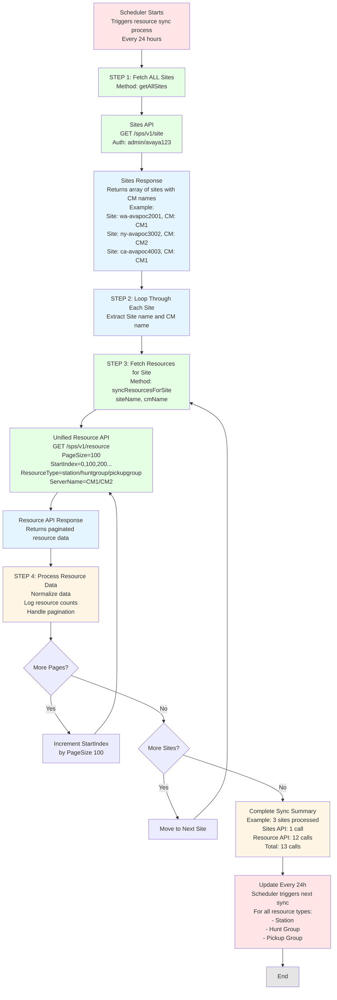

# Resource API Flow - Mermaid Diagram

You can render this as an image using:
- GitHub (automatically renders Mermaid)
- https://mermaid.live/
- VS Code with Mermaid extension
- Many documentation tools

## How to Generate Image from Mermaid:

### Method 1: Mermaid Live Editor
1. Go to https://mermaid.live/
2. Paste the Mermaid code above
3. Click "Actions" → "PNG" or "SVG" to download

### Method 2: VS Code
1. Install "Markdown Preview Mermaid Support" extension
2. Open this file in VS Code
3. Click "Preview" 
4. Right-click and save as image

### Method 3: GitHub
1. Commit this file to GitHub
2. GitHub automatically renders Mermaid diagrams
3. Screenshot the rendered diagram

